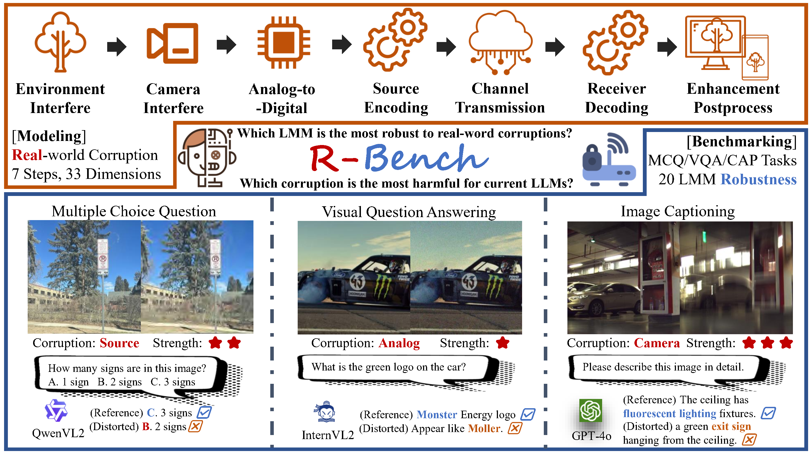
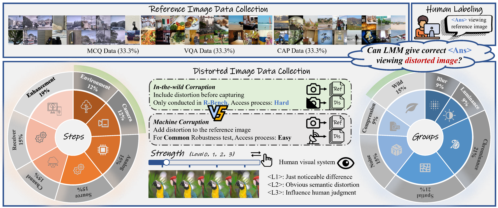
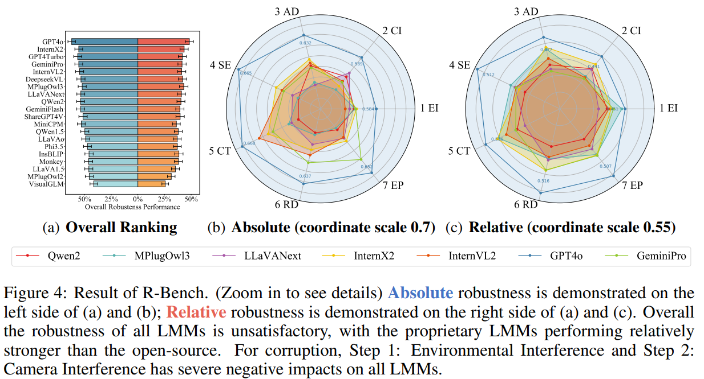

    
    
 

  
  
  
 

 <h1>R-Bench: Are your Large Multimodal Model Robust to Real-world Corruption?</h1>

 _a benchmark focused on the Real-world Robustness of LMMs_

 

      <a href="https://lcysyzxdxc.github.io" target="_blank">Chunyi Li</a>1,
      Jianbo Zhang1,
      <a href="https://zzc-1998.github.io/" target="_blank">Zicheng Zhang</a>1,
      <a href="https://teowu.github.io/" target="_blank">Haoning Wu</a>2,
      <a href="https://scholar.google.com/citations?user=Kzd0qtsAAAAJ&hl/" target="_blank">Yuan Tian</a>1,
      <a href="https://scholar.google.com/citations?user=nDlEBJ8AAAAJ&hl/" target="_blank">Wei Sun</a>1,
 

 

      <a href="https://guolusjtu.github.io/guoluhomepage/" target="_blank">Guo Lu</a>1,
      <a href="https://jhc.sjtu.edu.cn/~xiaohongliu/" target="_blank">Xiaohong Liu</a>1,
      <a href="https://minxiongkuo.github.io/" target="_blank">Xiongkuo Min</a>1,
      <a href="https://personal.ntu.edu.sg/wslin/Home.html" target="_blank">Weisi Lin</a>3,
      <a href="https://ee.sjtu.edu.cn/en/FacultyDetail.aspx?id=24&infoid=153&flag=153" target="_blank">Guangtao Zhai</a>1
 

 

  1Shanghai Jiaotong University,  201 AI,  3Nanyang Technological University
 
 
 <a href="https://www.arxiv.org/abs/2410.05474"><strong>Paper</strong></a> |
 <a href="https://github.com/Q-Future/R-Bench"><strong>Project Page</strong></a> |
 <a href="https://huggingface.co/datasets/lcysyzxdxc/R-Bench"><strong>Data</strong></a> 

      

**Why are LMMs excellent in benchmarks but limited in the real-world?**** Robustness is a crucial factor. In experiments, LMMs usually receive high-quality images, but in real-world scenarios that includes numerous corruption, such as object motion, lens blur, etc. If the robustness issue of LMMs can be solved, it may become as widly-used as single modality LLM, thus will bring tenfold convenience to daily human life. Therefore, we have established **R-Bench** to evaluate the robustness of LMMs in the real-world. R-Bench aims to test the resistance of different LMMs to corruptions and to identify the most significant corruptions affecting LMMs' performance, thereby pointing out optimization directions for future LMMs and helping them adapt to real-world images.

## Release
- [2024/10/10] 🔥 Release the [technical report](https://www.arxiv.org/abs/2410.05474) for **R-Bench**. 
<!-- - [2024/10/9] 🔥 Add support for [OpenCompass](https://github.com/open-compass/VLMEvalKit). Test your LMM robustness on MCQ task with one command. -->
- [2024/10/9] 🔥 [Github repo](https://github.com/Q-Future/R-Bench) for **R-Bench** is online!! [Dataset Download](https://huggingface.co/datasets/lcysyzxdxc/R-Bench)

## Benchmark Infomation

### Construction Criteria

      

**Reference Image：** The selection of references is based on three principles: (1) Diversity: The data must contain different subjects, backgrounds, styles, etc. (2) Reality: The images must come from natural scenes, such as UGC taken by average users. (3) Quality: As high-quality reference information, the images must not already be distorted.

**Distorted Image：** We considered 33 common corruption scenarios in the real world as dimensions for our benchmark. Into: (1) 7 steps from capturing to receiving. (2) 7 groups from low level vision. (3) 3 levels from corruption strength.

### Evaluate Criteria

Robustness can be categorized into absolute and relative aspects. **Absolute Robustness** refers to the performance that LMMs exhibit only on distorted images; while **Relative Robustness** is whether the outputs of LMMs are stable between reference/distorted images.

## Benchmark Result

      

GPT4o is fully superior to other models in each distortion step, with an overwhelming advantage in absolute robustness and a slight lead in relative robustness. The open-source LMMs InternLM-XComposer2 and InternVL2 perform relatively well and can surpass proprietary LMMs (except GPT4o) in some dimensions. Most LMMs score lower in the first two steps, and relatively higher in the last five.

| Absolute | MCQ low | MCQ mid | MCQ high | VQA low | VQA mid | VQA high | CAP low | CAP mid | CAP high | Overall |
|--------------------|---------|---------|----------|---------|---------|----------|---------|---------|----------|---------|
| GPT4o              | **0.8176**  | **0.7744**  | **0.7391**  | **0.7184**  | **0.7291**  | **0.6898**  | **0.4235**  | **0.4200**  | **0.3997**  | **0.6348**  |
| GPT4Turbo         | 0.7059  | 0.6398  | 0.6220   | 0.7055  | 0.7048  | 0.6806  | 0.3698  | 0.3811  | 0.3383   | 0.5722  |
| GeminiPro         | 0.7529  | 0.7012  | 0.6708   | 0.6233  | 0.6315  | 0.5796   | 0.4006  | 0.4040  | 0.3734   | 0.5710  |
| InternX2          | 0.7176  | 0.6770  | 0.6220   | 0.6288  | 0.6255  | 0.6180   | 0.4204  | 0.3982  | 0.3659   | 0.5638  |
| InternVL2         | 0.7118  | 0.7019  | 0.6280   | 0.6442  | 0.6436  | 0.6383   | 0.3759  | 0.3669  | 0.3412   | 0.5614  |
| GeminiFlash       | 0.7235  | 0.6708  | 0.7073  | 0.5975  | 0.6036  | 0.5575   | 0.3840  | 0.3522  | 0.3487   | 0.5495  |

| Relative | MCQ low | MCQ mid | MCQ high | VQA low | VQA mid | VQA high | CAP low | CAP mid | CAP high | Overall |
|--------------------|---------|---------|----------|---------|---------|----------|---------|---------|----------|---------|
| GPT4o              | **0.7471**  | **0.6894**  | **0.6159**  | 0.5787  | **0.5725**  | **0.5622**  | 0.2274  | 0.2134  | 0.2083   | **0.4907**  |
| InternX2          | 0.6353  | 0.6087  | 0.5488   | 0.5038  | 0.5127  | 0.4639   | 0.2440  | 0.2317  | 0.2070   | 0.4396  |
| MPlugOwl3         | 0.6087  | 0.5882  | 0.5488   | 0.5242  | 0.4877  | 0.4938   | 0.2423  | 0.2106  | **0.2205**  | 0.4359  |
| GPT4Turbo         | 0.5941  | 0.5590  | 0.4817   | **0.5872**  | 0.5575  | 0.5196  | 0.1972  | 0.1910  | 0.1836   | 0.4302  |
| DeepseekVL        | 0.5706  | 0.5342  | 0.4756   | 0.5384  | 0.5164  | 0.4934   | **0.2540**  | **0.2341**  | 0.2089   | 0.4251  |
| GeminiPro         | 0.6706  | 0.6211  | 0.5793   | 0.4640  | 0.4799  | 0.4510   | 0.1773  | 0.1874  | 0.1649   | 0.4219  |

Additionally, we find that proprietary models outperform open-source models but still significantly lag behind humans, which are not yet ready for the real-world. Thus we welcome LMM developers to join R-Bench, extending their real-world applications. Above is a quick look of our benchmark. Please refer to our [preprint](https://www.arxiv.org/pdf/2410.05474) for full benchmark result.

## How to use

### Inference (optional)

