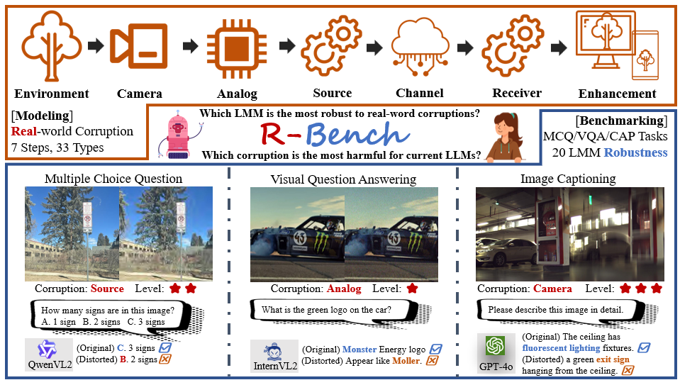

    
    
 

  
  
  
 

 <h1>R-Bench: Are your Large Multimodal Model Robust to Real-world Corruption?</h1>

 _a benchmark focused on the Real-world Robustness of LMMs_

 

      <a href="https://lcysyzxdxc.github.io" target="_blank">Chunyi Li</a>1,
      Jianbo Zhang1,
      <a href="https://zzc-1998.github.io/" target="_blank">Zicheng Zhang</a>1,
      <a href="https://teowu.github.io/" target="_blank">Haoning Wu</a>2,
      <a href="https://scholar.google.com/citations?user=Kzd0qtsAAAAJ&hl/" target="_blank">Yuan Tian</a>1,
      <a href="https://scholar.google.com/citations?user=nDlEBJ8AAAAJ&hl/" target="_blank">Wei Sun</a>1,
 

 

      <a href="https://guolusjtu.github.io/guoluhomepage/" target="_blank">Guo Lu</a>1,
      <a href="https://jhc.sjtu.edu.cn/~xiaohongliu/" target="_blank">Xiaohong Liu</a>1,
      <a href="https://minxiongkuo.github.io/" target="_blank">Xiongkuo Min</a>1,
      <a href="https://personal.ntu.edu.sg/wslin/Home.html" target="_blank">Weisi Lin</a>3,
      <a href="https://ee.sjtu.edu.cn/en/FacultyDetail.aspx?id=24&infoid=153&flag=153" target="_blank">Guangtao Zhai</a>1
 

 

  1Shanghai Jiaotong University,  201 AI,  3Nanyang Technological University
 
 
 <a href="https://github.com/Q-Future/R-Bench/blob/main/R_Bench_Preview.pdf"><strong>Paper</strong></a> |
 <a href="https://github.com/Q-Future/R-Bench"><strong>Project Page</strong></a> |
 <a href="https://huggingface.co/datasets/lcysyzxdxc/R-Bench"><strong>Data</strong></a> 
 

      
 

