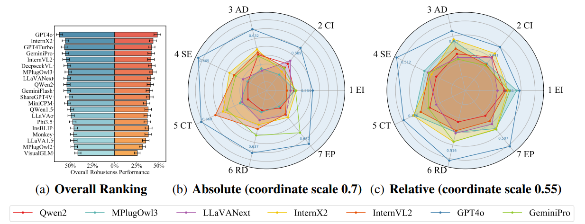

<div align="center">
    
    
 <div>
  <a href="https://github.com/lcysyzxdxc/"></a>
  <a href="https://github.com/Q-Future/R-Bench"></a>
  <a href="https://huggingface.co/datasets/lcysyzxdxc/R-Bench"></a>
 </div>

 <h1>R-Bench: Are your Large Multimodal Model Robust to Real-world Corruption?</h1>

 _a benchmark focused on the Real-world Robustness of LMMs_

 <div>
      <a href="https://lcysyzxdxc.github.io" target="_blank">Chunyi Li</a><sup>1</sup>,
      Jianbo Zhang<sup>1</sup>,
      <a href="https://zzc-1998.github.io/" target="_blank">Zicheng Zhang</a><sup>1</sup>,
      <a href="https://teowu.github.io/" target="_blank">Haoning Wu</a><sup>2</sup>,
      <a href="https://scholar.google.com/citations?user=Kzd0qtsAAAAJ&hl/" target="_blank">Yuan Tian</a><sup>1</sup>,
      <a href="https://scholar.google.com/citations?user=nDlEBJ8AAAAJ&hl/" target="_blank">Wei Sun</a><sup>1</sup>,
 </div>

 <div>
      <a href="https://guolusjtu.github.io/guoluhomepage/" target="_blank">Guo Lu</a><sup>1</sup>,
      <a href="https://jhc.sjtu.edu.cn/~xiaohongliu/" target="_blank">Xiaohong Liu</a><sup>1</sup>,
      <a href="https://minxiongkuo.github.io/" target="_blank">Xiongkuo Min</a><sup>1</sup>,
      <a href="https://personal.ntu.edu.sg/wslin/Home.html" target="_blank">Weisi Lin</a><sup>3</sup>,
      <a href="https://ee.sjtu.edu.cn/en/FacultyDetail.aspx?id=24&infoid=153&flag=153" target="_blank">Guangtao Zhai</a><sup>1</sup>
 </div>
 <div>
  <sup>1</sup>Shanghai Jiaotong University,  <sup>2</sup>01 AI,  <sup>3</sup>Nanyang Technological University
 </div> 
 <a href="https://www.arxiv.org/abs/2410.05474"><strong>Paper</strong></a> |
 <a href="https://github.com/Q-Future/R-Bench"><strong>Project Page</strong></a> |
 <a href="https://huggingface.co/datasets/lcysyzxdxc/R-Bench"><strong>Data</strong></a> 
</div>

<div style="width: 100%; text-align: center; margin:auto;">
      
</div>

**Why are LMMs excellent in benchmarks but limited in the real-world?**** Robustness is a crucial factor. In experiments, LMMs usually receive high-quality images, but in real-world scenarios that includes numerous corruption, such as object motion, lens blur, etc. If the robustness issue of LMMs can be solved, it may become as widly-used as single modality LLM, thus will bring tenfold convenience to daily human life. Therefore, we have established **R-Bench** to evaluate the robustness of LMMs in the real-world. R-Bench aims to test the resistance of different LMMs to corruptions and to identify the most significant corruptions affecting LMMs' performance, thereby pointing out optimization directions for future LMMs and helping them adapt to real-world images.

## Release
- [2024/10/12] 🔥 Add support for [OpenCompass](https://github.com/open-compass/VLMEvalKit). Test your LMM robustness on MCQ task with one command.
- [2024/10/10] 🔥 Release the [technical report](https://www.arxiv.org/abs/2410.05474) for **R-Bench**. 
- [2024/10/9] 🔥 [Github repo](https://github.com/Q-Future/R-Bench) for **R-Bench** is online!! [Dataset Download](https://huggingface.co/datasets/lcysyzxdxc/R-Bench)

## Benchmark Infomation

### Construction Criteria

<div align="center">
<div style="width: 100%; text-align: center; margin:auto;">
      
</div>
</div>

**Reference Image：** The selection of references is based on three principles: (1) Diversity: The data must contain different subjects, backgrounds, styles, etc. (2) Reality: The images must come from natural scenes, such as UGC taken by average users. (3) Quality: As high-quality reference information, the images must not already be distorted.

**Distorted Image：** We considered 33 common corruption scenarios in the real world as dimensions for our benchmark. Into: (1) 7 steps from capturing to receiving. (2) 7 groups from low level vision. (3) 3 levels from corruption strength.

### Evaluate Criteria

Robustness can be categorized into absolute and relative aspects. **Absolute Robustness** refers to the performance that LMMs exhibit only on distorted images; while **Relative Robustness** is whether the outputs of LMMs are stable between reference/distorted images.

## Benchmark Result

<div align="center">
<div style="width: 100%; text-align: center; margin:auto;">
      
</div>
</div>

GPT4o is fully superior to other models in each distortion step, with an overwhelming advantage in absolute robustness and a slight lead in relative robustness. The open-source LMMs InternLM-XComposer2 and InternVL2 perform relatively well and can surpass proprietary LMMs (except GPT4o) in some dimensions. Most LMMs score lower in the first two steps, and relatively higher in the last five.

| Absolute | MCQ low | MCQ mid | MCQ high | VQA low | VQA mid | VQA high | CAP low | CAP mid | CAP high | Overall |
|--------------------|---------|---------|----------|---------|---------|----------|---------|---------|----------|---------|
| GPT4o              | **0.8176**  | **0.7744**  | **0.7391**  | **0.7184**  | **0.7291**  | **0.6898**  | **0.4235**  | **0.4200**  | **0.3997**  | **0.6348**  |
| GPT4Turbo         | 0.7059  | 0.6398  | 0.6220   | 0.7055  | 0.7048  | 0.6806  | 0.3698  | 0.3811  | 0.3383   | 0.5722  |
| GeminiPro         | 0.7529  | 0.7012  | 0.6708   | 0.6233  | 0.6315  | 0.5796   | 0.4006  | 0.4040  | 0.3734   | 0.5710  |
| InternX2          | 0.7176  | 0.6770  | 0.6220   | 0.6288  | 0.6255  | 0.6180   | 0.4204  | 0.3982  | 0.3659   | 0.5638  |
| InternVL2         | 0.7118  | 0.7019  | 0.6280   | 0.6442  | 0.6436  | 0.6383   | 0.3759  | 0.3669  | 0.3412   | 0.5614  |
| GeminiFlash       | 0.7235  | 0.6708  | 0.7073  | 0.5975  | 0.6036  | 0.5575   | 0.3840  | 0.3522  | 0.3487   | 0.5495  |

| Relative | MCQ low | MCQ mid | MCQ high | VQA low | VQA mid | VQA high | CAP low | CAP mid | CAP high | Overall |
|--------------------|---------|---------|----------|---------|---------|----------|---------|---------|----------|---------|
| GPT4o              | **0.7471**  | **0.6894**  | **0.6159**  | 0.5787  | **0.5725**  | **0.5622**  | 0.2274  | 0.2134  | 0.2083   | **0.4907**  |
| InternX2          | 0.6353  | 0.6087  | 0.5488   | 0.5038  | 0.5127  | 0.4639   | 0.2440  | 0.2317  | 0.2070   | 0.4396  |
| MPlugOwl3         | 0.6087  | 0.5882  | 0.5488   | 0.5242  | 0.4877  | 0.4938   | 0.2423  | 0.2106  | **0.2205**  | 0.4359  |
| GPT4Turbo         | 0.5941  | 0.5590  | 0.4817   | **0.5872**  | 0.5575  | 0.5196  | 0.1972  | 0.1910  | 0.1836   | 0.4302  |
| DeepseekVL        | 0.5706  | 0.5342  | 0.4756   | 0.5384  | 0.5164  | 0.4934   | **0.2540**  | **0.2341**  | 0.2089   | 0.4251  |
| GeminiPro         | 0.6706  | 0.6211  | 0.5793   | 0.4640  | 0.4799  | 0.4510   | 0.1773  | 0.1874  | 0.1649   | 0.4219  |

Additionally, we find that proprietary models outperform open-source models but still significantly lag behind humans, which are not yet ready for the real-world. Thus we welcome LMM developers to join R-Bench, extending their real-world applications. Above is a quick look of our benchmark. Please refer to our [preprint](https://www.arxiv.org/pdf/2410.05474) for full benchmark result.

## How to use

### Using VLMEvalKit

You may evaluate your LMM with one command! Please download [OpenCompass](https://github.com/open-compass/VLMEvalKit) and run:

```
git clone https://github.com/open-compass/VLMEvalKit.git
cd VLMEvalKit
pip install -e .
python run.py --data R-Bench-Dis --model InternVL2-1B --verbose
```

**Noted this is only for R-Bench MCQ Section!** For full dataset please use the following steps.

### Using our pipeline

#### Inference (optional)

First please download the dataset from [modelscope](https://www.modelscope.cn/datasets/lcysyzxdxc/R-Bench):

```
from modelscope.msdatasets import MsDataset
ms_dataset = MsDataset.load(
            'R-Bench', namespace='lcysyzxdxc',
            subset_name='default', split='test')
```

Each instance in your dataset should be like:

```
'name': 'MMBench_35.jpg',
 'question': "What's the function of the demonstrated object?",
 'choice': 'A.running; B.Play football; C.Play tennis; D.Play basketball',
 'answer': 'C',
 'type': 'MCQ',
 'distortion': 1,
 'strength': 2,
 'ref_image': ...
 'dis_image': ...
```

Then you may define a function based on `Your_LMM`. It shold generate answer from `ms_dataset` above:

```
question=ms_dataset[num]['question']
choice=ms_dataset[num]['choice']
task=ms_dataset[num]['type']
byte=ms_dataset[num]['ref_image']['bytes']

def inference(question,choice,task,byte):
    
    if task=='MCQ':
        prompt = question + "\n" + choice +"\nAnswer with the option's letter from the given choices directly."
    elif task=='VQA':
        prompt = question+". Please answer no more than 10 words"
    elif task=='CAP':
        prompt =  "Please describe this image in general. Directly provide the description, do not include prefix like 'This image depicts'"
    else:
        raise ValueError('No task named'+task)
        return
                         
    image_file = io.BytesIO(byte)
    image = Image.open(image_file).convert('RGB')    

    answer = Your_LMM(image=image,prompt=prompt)
                         
    return answer
```

And finally you will got `model_name+_ref.csv` and `model_name+_dis.csv`. Check the `R-Bench-Script.ipynb` code for detail. You are strongly recommended to test in your own environment beyond this script, at your convenience.

#### Evaluation

Please use GPT-3.5 for evaluation (recommended). If you don't have api, you may try other LLM assisted evaluation. Both example are provided in `R-Bench-Script.ipynb`.

The `msg` for MCQ/VQA/CAP task are:

```
    if ans_file['type'][num]=='MCQ':
        for i in range(5):
            msg = f'''You will now be provided with a question [{question}] and a set of options [{answers}] with option [{correct_ans}] being the correct answer.
            Additionally, there will be an answer [{answer}] provided by a respondent. Please determine whether the respondent's answer is correct considering the context of the question.
            Even if the word choice is not completely the same, you can decide based on the given options and see whether the one in the answer is close enough to the given correct answer
            The result is 1 if the answer is correct and else the result is 0. Please only provide the result in the following format: Score:'''
            ...


    elif ans_file['type'][num]=='VQA':
        for i in range(5):
            msg= f'''Given the question [{question}], evaluate whether the response [{answer}] completely matches the correct answer [{correct_ans}]. 
            First, check the response and please rate score 0 if the response is not a valid answer.
            Please rate score 2 if the response completely or almost completely matches the correct answer on completeness, accuracy, and relevance. 
            Please rate score 1 if the response partly matches the correct answer on completeness, accuracy, and relevance.
            Please rate score 0 if the response doesn't match the correct answer on completeness, accuracy, and relevance at all.
            Please only provide the result in the following format: Score:'''
            ...

    elif ans_file['type'][num]=='CAP':
        corrects=eval(correct_ans)
        for correct in corrects:
            msg= f'''Evaluate whether the sentence [{answer}] completely matches the correct answer [{correct}]. 
            First, check the response and please rate score 0 if the response is not a valid answer.
            Please rate score 2 if the response completely or almost completely matches the correct answer on completeness, accuracy, and relevance. 
            Please rate score 1 if the response partly matches the correct answer on completeness, accuracy, and relevance.
            Please rate score 0 if the response doesn't match the correct answer on completeness, accuracy, and relevance at all.
            Please only provide the result in the following format: Score:'''
            ...
```

#### Show final result

Your final result will be two table, representing absolute/relative robustness in multiple dimension. Like:

| Task:     | MCQ         | VQA       | CAP         |         |         |             |          |
| Strength: | high        | mid       | low         |         |         |             |          |
| Step:     | Environment | Camera    | Analog      | Source  | Channel | Receive     | Enhance  |
| Group:    | Blur        | Luminance | Chrominance | Spatial | Noise   | Compression | Wild     |


## Contact
Feel free to contact the R-Bench team for queries.
```
Chunyi Li, lcysyzxdxc@sjtu.edu.cn, @lcysyzxdxc
```

## Citation
If you find our work interesting, please feel free to cite our paper:
```
@misc{li2024rbench,
    title={R-Bench: Are your Large Multimodal Model Robust to Real-world Corruptions?},
    author={Chunyi Li and Jianbo Zhang and Zicheng Zhang and Haoning Wu and Yuan Tian and Wei Sun and Guo Lu and Xiaohong Liu and Xiongkuo Min and Weisi Lin and Guangtao Zhai},
    year={2024},
    eprint={2410.05474},
    archivePrefix={arXiv},
    primaryClass={cs.CV}
}
```